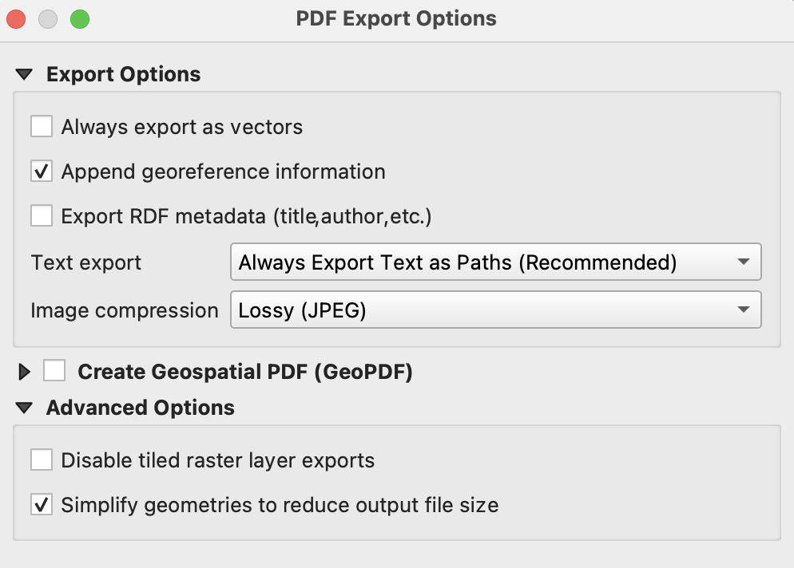

# QGIS

## bcfishpass_30k.qlr

This is a QGIS layer file defining and symbolizing all layers required for general fish passage mapping ([see samples](https://www.hillcrestgeo.ca/outgoing/fishpassage/projects/)).

### Database connection

All postgis layers in the .qlr file are connected via the `bcfishpass` postgresql service. To add the service, modify the parameters for the `bcfishpass` service in the provided `.pg_service_example.conf` file to match the parameters for your database connection. Then move the file to the [location expected for your operating system](https://www.postgresql.org/docs/current/libpq-pgservice.html).

With the service configuration file in place, open QGIS, right click on PostgreSQL in the Browser and select 'New Connection'. In the dialogue box, enter `bcfishpass` as the Service and give the connection a name.  To help with handling large tables, check these options:

    [x] Don't resolve types of unrestricted columns (GEOMETRY)
    [x] Use estimated table metadata

### Load additional base data

The QGIS layer file includes several data sources that are not loaded to the `bcfishpass` database by default.

To download these additional sources to the postgres db specified by `$DATABASE_URL`:

    make

The makefile downloads most layers provincially, but contours are split up into chunks (1:250k tiles).
To minimize bandwidth use, consider editing `tctr_tiles.txt` to include only the NTS 250k tiles within your area of interest.

## 48x36 30k pdfs

When generating pdfs, remember to:

- edit title
- modify selection for records in dbm_mof_50k_grid to match area of interest eg, for `ZYMO` group:

        select distinct map_tile 
        from whse_basemapping.dbm_mof_50k_grid a
        inner join whse_basemapping.fwa_watershed_groups_poly b
        on st_intersects(a.geom, b.geom)
        where b.watershed_group_code = 'KISP'
        order by map_tile

- double check that the model displayed is correct:
    + crossings (salmon/steelhead/wct etc)
    + definite barriers (salmon/steelhead/wct etc)
    + streams (width=gradient or width=habitat)
- if adding additional legend/text items, check that font matches (arial)
- check that map frame/project CRS matches UTM zone of study area
- modify atlas as required
- to minimize file sizes, set layout `Export Settings` `Export Resolution` to 150dpi (layout side panel, layout tab) and check the `Print as raster` box
- export to pdf with these options:

- upload to `https://www.hillcrestgeo.ca/outgoing/fishpassage/projects/<project>/archive/<date>`
- create a single archive holding all the maps for easy download (zip)

        zip -r elk_2022-03-17.zip *pdf

- update symbolic links in `https://www.hillcrestgeo.ca/outgoing/fishpassage/projects/<project>` to point to the latest files

        ln -s archive/2022-03-17/* .